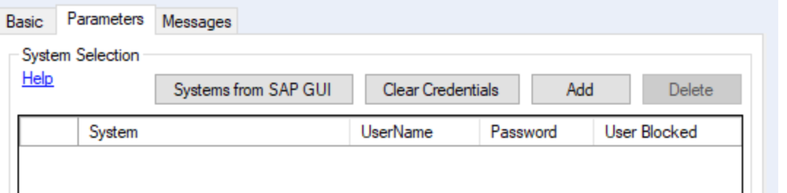
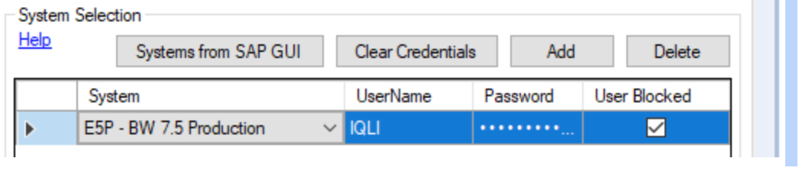

# Troubleshooting

## Message tab
If there’s any error occurring, it can be read in the “messages” tab of the tool that throws an error message.

## User Blocked

If you fill in a wrong password, the SAPLogon tool will block the user. What you have to do is to select the System you want to connect to, click Clear Credentials and you’re good to insert new credentials.

## Logging

If you need some more information regarding the issue you’re tracing, you can always check the logs written by the SAP tools. Everyday that you’re using the tools in Alteryx, they will write a log where they append the new information to. You can find it here:

C:\Users\[USERNAME]\AppData\Local\ASCLog

Note that the newest information is written at the bottom. This overview should give some more in depth information on what is going on. When reaching out to DVW, always include the log file where the issue is shown.

## Who to contact

In case that you need more assistance with the SAP connectors, I would recommend to take one of the following steps (in the this order)

- If you have a license at DVW Analytics, I’d recommend to have a look at their tutorial page. You can find it [here](https://www.dvwanalytics.com/tutorials.html).
- Talk to our internal SAP guru Nina! She’s in touch with DVW, and she is the internal expert.
- Alternatively, you can also read out to DVW. One of our main contact persons from DVW is Purnima (purnima.talwar@dvwsolutions.com). She is an expert in the SAP DVW tools, and will be able to help out (consult with Nina first before reaching out)
- Lastly, at Novo, Morten Viholt (mvht@novonordisk.com) is responsible for the SAP connectors in Alteryx. As a last resource, you can reach out to him. 