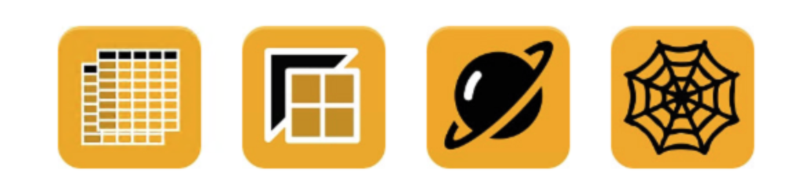
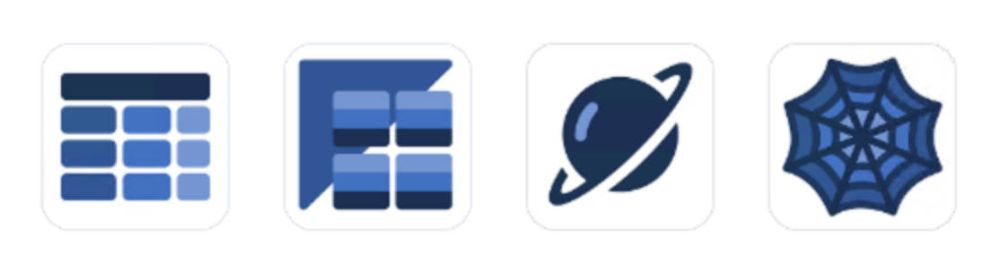
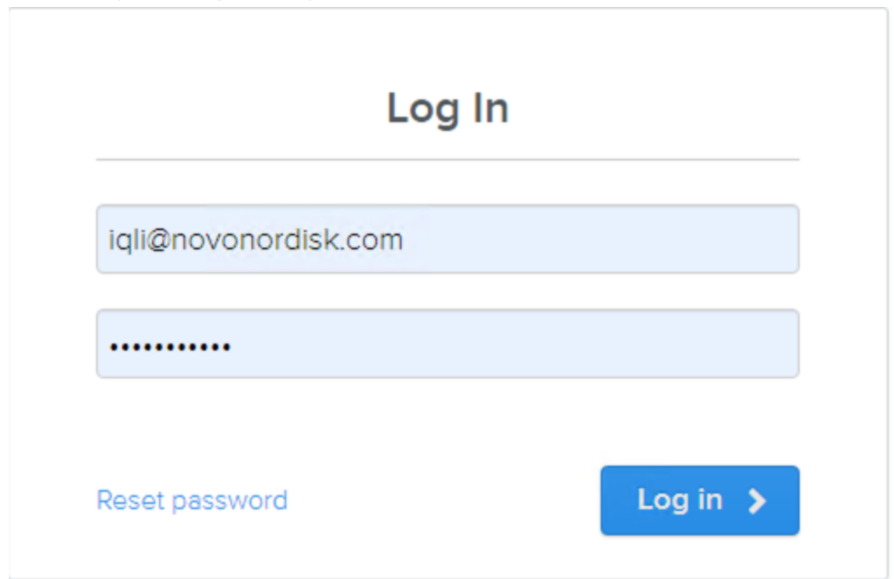

# Written Guidelines

## Connecting to SAP BW Through Alteryx

### What is SAP
SAP (System Analysis Program) is a tool used for enterprise resource planning (ERP). In general, SAP is a quite closed system: Changing data, inserting data or extracting data is in general a bit more complex than interacting with an SQL database. This little guide tries to explain how you can extract data from SAP within Alteryx with the DVW Tools.

### DVW Analytics Tools
DVW Analytics (De Villiers Walton Analytics) is a company that provides connectors to SAP from multiple systems, for example Tableau, Power BI, Excel, KNIME and Alteryx. In this document, we will discuss the connection to SAP through Alteryx.

More specifically, we are going to connect to SAP BW, which is abbreviated for SAP Business Warehouse. This contains reports made in SAP on top of SAP ECC. SAP ECC is the ERP Central Component, which can be seen as the raw data. SAP BW can be seen as consolidated data from ECC. Most of the time, you’ll be working with SAP BW data. This is prepared data by a SAP developer, instead of raw transactional data from ECC.

The tools provided by DVW are split up in two generations: V1 and V2. The big difference between the two generations is that they depend on a different communication protocol. The V1 tools use VEX technology, which is not supported by SAP anymore (but it is still functional). The V2 tools use BISC technology, which is the recommended way of interacting with SAP. You do not need to know about the difference between the two. If you are connecting to SAP through Alteryx for a client for the first time, promote the V2 version. If they are already connecting to SAP with DVW tools, just stick with the version they are using.

The V1 tools can be recognized by their yellow appearance, and the V2 tools can be recognized by their blue appearance.

### Getting a DVW Licence
Applying for a free trial can be done by visiting [this page](https://www.dvwanalytics.com/free-trial.html). Note that Novo employees will receive a 90 days trial if they sign up with their Novo email. Other clients will receive a 14 days trial.

The email you use for signing up here is also the email to which your license is bound. How this works exactly can be found further on in the “Getting Started with the v1 tools” section.

Install SAP BW v1 tools
To install the SAP BW v1 tools, we need to have three dependencies in place:
- The SAP BW Tools
- Some SAP dependency files (SAP NetWeaver RFC Libraries)
- Access to a SAP BW system

First, let’s download the SAP BW tools:
- Navigate to https://www.dvwanalytics.com/
- Go to Resources > Software download, It will ask you to login with your DVW licence

- This page shows all the different downloads which they have. For now, we will focus on the “ASC for Alteryx Designer Downloads”.
- We would like to download the V1 tools. Before doing so, we need to figure out of we are running Alteryx as an admin version or not. Lets open Alteryx, go to Help > About and see the version you’re running:

**...continue reading [here](https://docs.google.com/document/d/1A0z8ocjgm9XqDBWhdnqJoSJAptCTlM7t9ZA8XlYfuiA/edit#)**